# DB-GPT 统一语义层架构设计文档

## 1. 概述

### 1.1 背景

当前 DB-GPT 的 Text2SQL 场景主要依赖物理数据库 schema 信息来生成 SQL，缺乏业务语义理解能力。用户希望：

1. **更准确的 SQL 生成**：通过业务语义理解，生成更符合业务逻辑的 SQL
2. **更好的推理洞察**：基于业务规则和语义关系，提供更有价值的分析结果
3. **统一语义驱动**：所有数据 Agent 的查询、分析、洞察、决策都由统一语义层驱动

### 1.2 目标

构建框架级的统一语义层，实现：

- 语义模型与数据源绑定
- 业务术语到物理 schema 的映射
- 业务规则验证与计算
- 查询模板匹配与生成
- 推理规则驱动的洞察生成

### 1.3 范围

| 语义建模范围 | 说明 |
|-------------|------|
| Schema 语义 | 表/列的业务含义、数据类型语义化 |
| Relations 关系 | 实体间的业务关系、JOIN 条件 |
| Business Rules 业务规则 | 数据验证、计算规则、约束条件 |
| Query Templates 查询模板 | 常见问题的 SQL 模式库 |
| Reasoning Rules 推理规则 | 洞察生成、异常检测规则 |

---

## 2. 系统架构

### 2.1 整体架构图

```
┌─────────────────────────────────────────────────────────────────────────────┐
│                           外部语义建模平台                                    │
│                    (DataModel/ERWin/PowerDesigner等)                         │
└─────────────────────────────────────────────────────────────────────────────┘
                                      │
                              导入/同步 API
                                      ▼
┌─────────────────────────────────────────────────────────────────────────────┐
│                         语义层 (Semantic Layer)                              │
├─────────────────────────────────────────────────────────────────────────────┤
│                                                                              │
│  ┌──────────────────────────────────────────────────────────────────────┐   │
│  │                    SemanticModelManager (核心服务)                     │   │
│  │  ┌─────────────┐ ┌─────────────┐ ┌─────────────┐ ┌─────────────┐     │   │
│  │  │ 模型存储     │ │ 规则引擎    │ │ 模板引擎    │ │ 嵌入服务    │     │   │
│  │  │ ModelStore  │ │ RuleEngine │ │ TemplateEng│ │ EmbedClient │     │   │
│  │  └─────────────┘ └─────────────┘ └─────────────┘ └─────────────┘     │   │
│  └──────────────────────────────────────────────────────────────────────┘   │
│                                      │                                       │
│         ┌────────────────────────────┼────────────────────────────┐         │
│         ▼                            ▼                            ▼         │
│  ┌─────────────────┐    ┌─────────────────────┐    ┌─────────────────┐     │
│  │ SemanticResource│    │SemanticDBSummary    │    │SemanticPrompt   │     │
│  │   (Agent资源层) │    │   Client (RAG层)    │    │  Adapter(提示层)│     │
│  └─────────────────┘    └─────────────────────┘    └─────────────────┘     │
│                                                                              │
└─────────────────────────────────────────────────────────────────────────────┘
                                      │
         ┌────────────────────────────┼────────────────────────────┐
         ▼                            ▼                            ▼
┌─────────────────┐        ┌─────────────────┐        ┌─────────────────┐
│   数据查询Agent  │        │   分析洞察Agent  │        │   决策支持Agent  │
│ (Text2SQL场景)  │        │  (Dashboard场景) │        │   (报告生成等)   │
└────────┬────────┘        └────────┬────────┘        └────────┬────────┘
         │                          │                          │
         └──────────────────────────┼──────────────────────────┘
                                    ▼
┌─────────────────────────────────────────────────────────────────────────────┐
│                            数据源层 (DataSource Layer)                       │
│  ┌─────────────┐  ┌─────────────┐  ┌─────────────┐  ┌─────────────┐        │
│  │   MySQL     │  │ PostgreSQL  │  │    Neo4j    │  │ 联邦查询引擎 │        │
│  │  Connector  │  │  Connector  │  │  Connector  │  │(大数据平台)  │        │
│  └─────────────┘  └─────────────┘  └─────────────┘  └─────────────┘        │
└─────────────────────────────────────────────────────────────────────────────┘
```

### 2.2 组件职责

| 组件 | 职责 | 依赖 |
|------|------|------|
| **SemanticModelManager** | 语义模型的统一管理服务，提供模型CRUD、查询增强、规则执行等核心能力 | ModelStore, RuleEngine, TemplateEngine |
| **SemanticModelStore** | 语义模型的持久化存储，支持Neo4j或RDBMS | Neo4j/MySQL |
| **BusinessRuleEngine** | 业务规则的解析与执行，支持验证、计算、约束 | 无 |
| **QueryTemplateEngine** | 查询模板的匹配与实例化 | EmbeddingClient |
| **SemanticResource** | Agent资源层的语义增强包装器 | DBResource, SemanticModelManager |
| **SemanticDBSummaryClient** | RAG层的语义增强，提供语义感知的schema检索 | DBSummaryClient, SemanticModelManager |
| **SemanticPromptAdapter** | 提示词层的语义注入，统一增强所有场景的提示词 | AppScenePromptTemplateAdapter |

### 2.3 核心流程交互图

> 以下使用 Mermaid 图表展示核心流程，详细的时序和状态流转见各小节。

#### 2.3.1 整体架构图

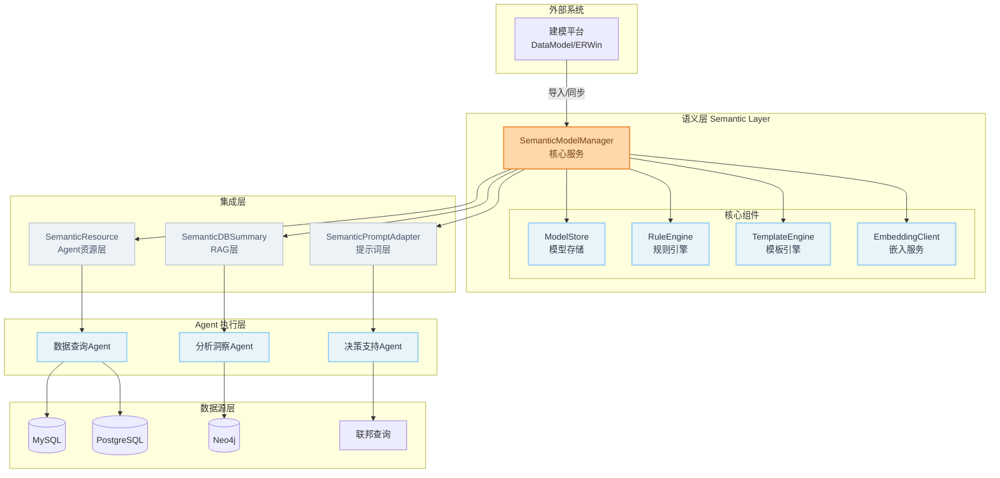

#### 2.3.2 语义模型导入与绑定流程

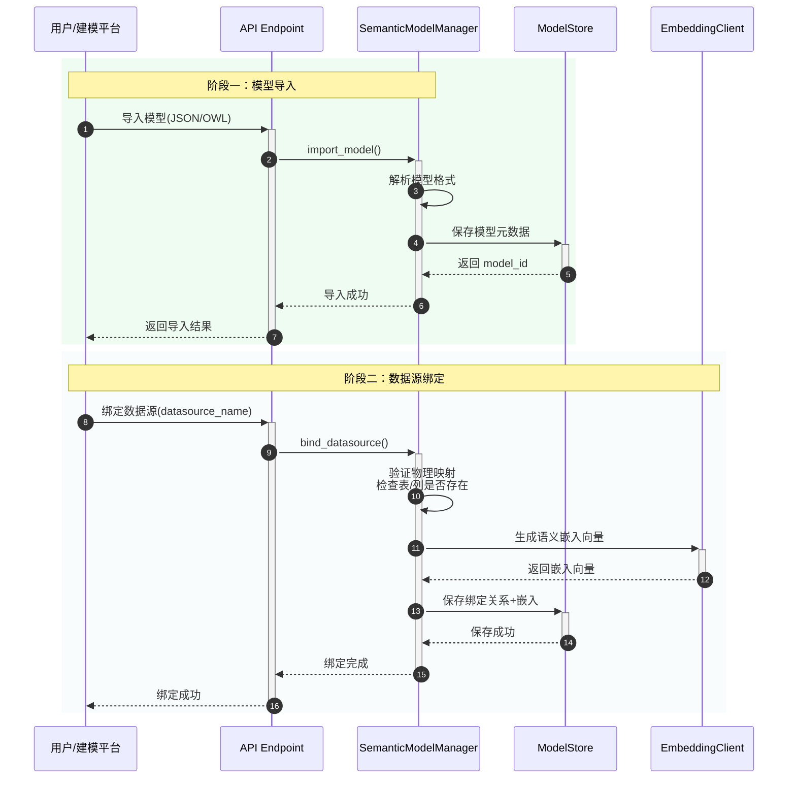

#### 2.3.3 用户查询处理流程（核心）

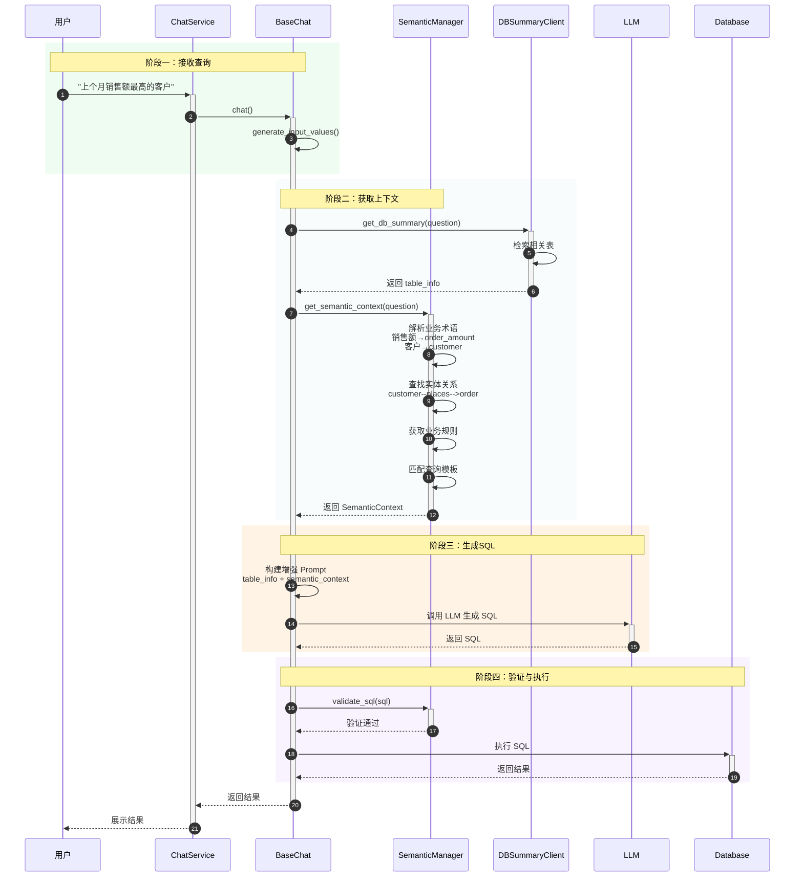

#### 2.3.4 语义上下文获取详细流程

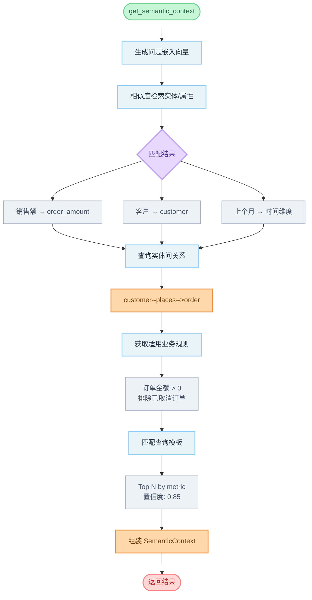

#### 2.3.5 业务规则验证流程

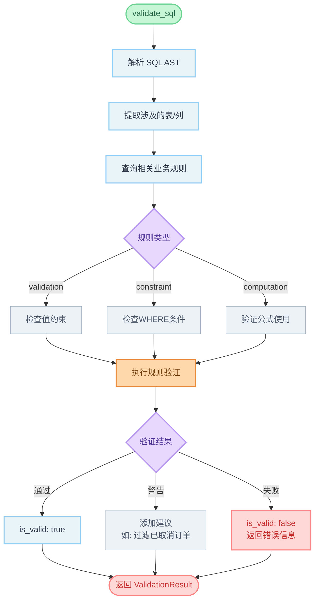

#### 2.3.6 查询模板匹配与实例化流程

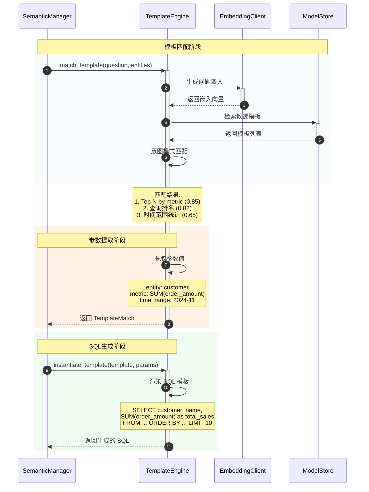

#### 2.3.7 Agent 资源层集成流程

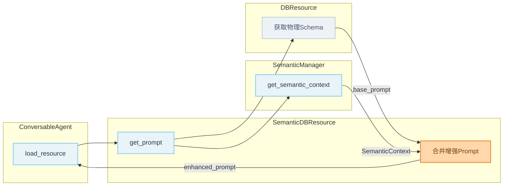

**增强后的 Prompt 结构:**

```
## 数据库 Schema
Table: t_customer
- customer_id (int, PK)
- cust_name (varchar)
...

## 语义上下文 (Semantic Context)

### 业务术语映射
- 客户 → t_customer (业务实体: Customer)
- 销售额 → t_order.order_amount (度量: 可求和)

### 实体关系
- customer --[places]--> order
  JOIN: t_customer.customer_id = t_order.customer_id

### 业务规则
- 已取消订单不计入统计 (status != 'cancelled')

### 查询建议
- 推荐使用 SUM(order_amount) 计算销售额
```

#### 2.3.8 查询生命周期状态图

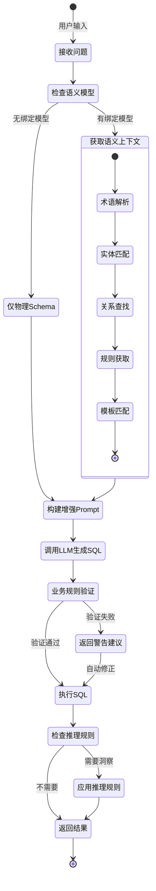

#### 2.3.9 数据模型 ER 图

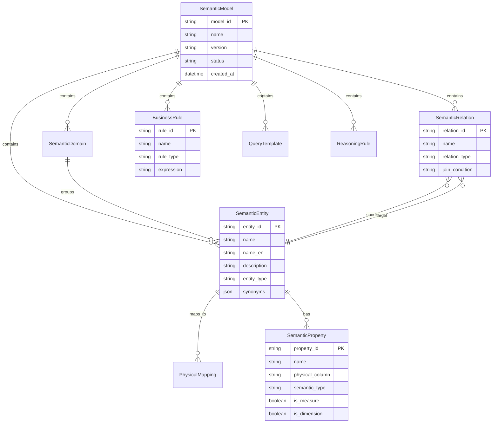

#### 2.3.10 组件类图

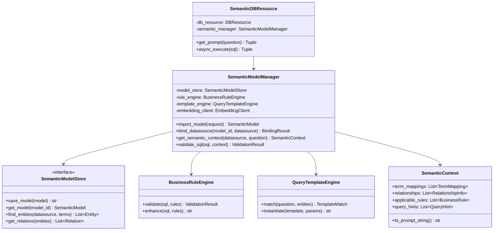

---

## 3. 数据模型设计

### 3.1 核心实体关系图

```
┌─────────────────┐       ┌─────────────────┐       ┌─────────────────┐
│ SemanticDomain  │◄──────│ SemanticEntity  │───────►│PhysicalMapping  │
│   (业务域)       │  1:N  │   (业务实体)     │  1:N   │  (物理映射)     │
└─────────────────┘       └────────┬────────┘       └─────────────────┘
                                   │ 1:N
                                   ▼
                          ┌─────────────────┐
                          │SemanticProperty │
                          │   (语义属性)     │
                          └─────────────────┘

┌─────────────────┐       ┌─────────────────┐       ┌─────────────────┐
│ SemanticEntity  │◄──────│SemanticRelation │───────►│ SemanticEntity  │
│   (源实体)       │       │   (语义关系)     │       │   (目标实体)     │
└─────────────────┘       └─────────────────┘       └─────────────────┘

┌─────────────────┐       ┌─────────────────┐       ┌─────────────────┐
│  BusinessRule   │       │ QueryTemplate   │       │ ReasoningRule   │
│   (业务规则)     │       │  (查询模板)      │       │   (推理规则)     │
└─────────────────┘       └─────────────────┘       └─────────────────┘
```

### 3.2 详细数据模型

#### 3.2.1 语义域 (SemanticDomain)

```python
@dataclass
class SemanticDomain:
    """业务域 - 用于组织和分类业务实体"""

    domain_id: str              # 域ID，如 "sales", "inventory"
    name: str                   # 域名称，如 "销售域", "库存域"
    name_en: str                # 英文名称
    description: str            # 域描述
    parent_domain_id: Optional[str] = None  # 父域ID，支持层级结构
    icon: Optional[str] = None  # 图标
    order: int = 0              # 排序

    # 元数据
    created_at: datetime
    updated_at: datetime
    created_by: Optional[str] = None
```

**示例**：
```json
{
    "domain_id": "sales",
    "name": "销售域",
    "name_en": "Sales Domain",
    "description": "包含客户、订单、产品等销售相关业务实体",
    "parent_domain_id": null
}
```

#### 3.2.2 语义实体 (SemanticEntity)

```python
@dataclass
class SemanticEntity:
    """语义实体 - 对应业务概念，映射到物理表"""

    entity_id: str              # 实体ID
    name: str                   # 业务名称，如 "客户", "订单"
    name_en: str                # 英文名称，如 "Customer", "Order"
    description: str            # 业务描述
    domain_id: str              # 所属业务域

    # 物理映射（支持多数据源）
    physical_mappings: List[PhysicalMapping]

    # 语义属性
    properties: List[SemanticProperty]

    # 实体类型
    entity_type: str = "master"  # master(主数据), transaction(事务), reference(参考)

    # 业务标签
    tags: List[str] = field(default_factory=list)

    # 同义词（用于NL理解）
    synonyms: List[str] = field(default_factory=list)  # 如 ["顾客", "买家", "消费者"]

    # 元数据
    created_at: datetime
    updated_at: datetime


@dataclass
class PhysicalMapping:
    """物理映射 - 实体到数据库表的映射"""

    mapping_id: str
    datasource_name: str        # DB-GPT数据源名称
    database_name: str          # 数据库名
    schema_name: Optional[str]  # Schema名（如PostgreSQL）
    table_name: str             # 物理表名

    # 映射类型
    mapping_type: str = "primary"  # primary(主映射), secondary(辅助), history(历史)

    # 过滤条件（用于分表场景）
    filter_condition: Optional[str] = None  # 如 "status = 'active'"
```

**示例**：
```json
{
    "entity_id": "customer",
    "name": "客户",
    "name_en": "Customer",
    "description": "购买产品或服务的个人或企业客户",
    "domain_id": "sales",
    "entity_type": "master",
    "synonyms": ["顾客", "买家", "消费者", "用户"],
    "physical_mappings": [
        {
            "datasource_name": "sales_db",
            "database_name": "sales",
            "table_name": "t_customer"
        }
    ],
    "properties": [...]
}
```

#### 3.2.3 语义属性 (SemanticProperty)

```python
@dataclass
class SemanticProperty:
    """语义属性 - 实体的业务属性，映射到物理列"""

    property_id: str
    entity_id: str              # 所属实体

    # 业务语义
    name: str                   # 业务名称，如 "客户姓名"
    name_en: str                # 英文名称，如 "customer_name"
    description: str            # 业务描述

    # 物理映射
    physical_column: str        # 物理列名

    # 数据类型语义化
    semantic_type: str          # 语义类型: string, integer, decimal, date, datetime,
                                #          currency, percentage, quantity, code, id
    physical_type: str          # 物理类型: varchar(100), int, decimal(18,2)

    # 度量/维度标识
    is_measure: bool = False    # 是否度量（可聚合的数值）
    is_dimension: bool = True   # 是否维度（可分组的属性）

    # 聚合方式（仅度量有效）
    default_aggregation: Optional[str] = None  # sum, avg, count, min, max, count_distinct

    # 格式化
    display_format: Optional[str] = None  # 显示格式，如 "#,##0.00", "yyyy-MM-dd"
    unit: Optional[str] = None  # 单位，如 "元", "件", "%"

    # 值域约束
    value_range: Optional[Dict] = None  # {"min": 0, "max": 100} 或 {"enum": ["A", "B", "C"]}

    # 空值处理
    nullable: bool = True
    default_value: Optional[str] = None

    # 同义词
    synonyms: List[str] = field(default_factory=list)

    # 排序
    order: int = 0
```

**示例**：
```json
{
    "property_id": "customer_name",
    "entity_id": "customer",
    "name": "客户姓名",
    "name_en": "customer_name",
    "description": "客户的全名",
    "physical_column": "cust_name",
    "semantic_type": "string",
    "physical_type": "varchar(100)",
    "is_measure": false,
    "is_dimension": true,
    "synonyms": ["姓名", "名字", "客户名"]
}
```

```json
{
    "property_id": "order_amount",
    "entity_id": "order",
    "name": "订单金额",
    "name_en": "order_amount",
    "description": "订单的总金额，不含税",
    "physical_column": "total_amount",
    "semantic_type": "currency",
    "physical_type": "decimal(18,2)",
    "is_measure": true,
    "is_dimension": false,
    "default_aggregation": "sum",
    "display_format": "#,##0.00",
    "unit": "元",
    "value_range": {"min": 0},
    "synonyms": ["金额", "总额", "订单额"]
}
```

#### 3.2.4 语义关系 (SemanticRelation)

```python
@dataclass
class SemanticRelation:
    """语义关系 - 实体间的业务关系"""

    relation_id: str

    # 关系语义
    name: str                   # 关系名称，如 "下单"
    name_en: str                # 英文名称，如 "places"
    description: str            # 关系描述，如 "客户下订单"

    # 关系端点
    source_entity_id: str       # 源实体
    target_entity_id: str       # 目标实体

    # 关系类型
    relation_type: str          # one_to_one, one_to_many, many_to_one, many_to_many

    # 物理实现
    join_type: str = "inner"    # inner, left, right, full
    join_condition: str         # SQL JOIN条件

    # 通过中间表（多对多场景）
    through_table: Optional[str] = None
    through_source_column: Optional[str] = None
    through_target_column: Optional[str] = None

    # 关系方向描述（用于NL理解）
    forward_description: str    # 正向描述，如 "客户下了订单"
    reverse_description: str    # 反向描述，如 "订单属于客户"

    # 是否必须
    is_required: bool = False   # 是否强制关联
```

**示例**：
```json
{
    "relation_id": "customer_places_order",
    "name": "下单",
    "name_en": "places",
    "description": "客户下订单的关系",
    "source_entity_id": "customer",
    "target_entity_id": "order",
    "relation_type": "one_to_many",
    "join_type": "left",
    "join_condition": "customer.customer_id = order.customer_id",
    "forward_description": "客户下了订单",
    "reverse_description": "订单属于客户"
}
```

#### 3.2.5 业务规则 (BusinessRule)

```python
@dataclass
class BusinessRule:
    """业务规则 - 数据验证、计算、约束规则"""

    rule_id: str
    name: str                   # 规则名称
    description: str            # 规则描述

    # 规则类型
    rule_type: str              # validation(验证), computation(计算),
                                # constraint(约束), derivation(派生)

    # 规则表达式
    expression: str             # SQL表达式或Python表达式
    expression_type: str = "sql"  # sql, python, jinja2

    # 应用范围
    applies_to_entities: List[str]    # 适用的实体ID列表
    applies_to_properties: List[str]  # 适用的属性ID列表

    # 规则优先级
    priority: int = 0           # 优先级，数字越大优先级越高

    # 错误处理
    error_message: str          # 规则违反时的错误信息
    error_level: str = "error"  # error, warning, info

    # 是否启用
    is_active: bool = True
```

**示例**：
```json
{
    "rule_id": "order_amount_positive",
    "name": "订单金额必须为正",
    "description": "订单金额必须大于0",
    "rule_type": "validation",
    "expression": "order_amount > 0",
    "expression_type": "sql",
    "applies_to_entities": ["order"],
    "applies_to_properties": ["order_amount"],
    "error_message": "订单金额必须大于0",
    "error_level": "error"
}
```

```json
{
    "rule_id": "order_total_calculation",
    "name": "订单总额计算",
    "description": "订单总额 = 商品金额 + 运费 - 折扣",
    "rule_type": "computation",
    "expression": "product_amount + shipping_fee - discount_amount",
    "expression_type": "sql",
    "applies_to_entities": ["order"],
    "applies_to_properties": ["order_total"]
}
```

#### 3.2.6 查询模板 (QueryTemplate)

```python
@dataclass
class QueryTemplate:
    """查询模板 - 常见问题的SQL模式"""

    template_id: str
    name: str                   # 模板名称
    description: str            # 模板描述

    # 意图匹配
    intent_patterns: List[str]  # 自然语言模式，如 ["查询{entity}的{metric}"]
    intent_keywords: List[str]  # 关键词，如 ["销售额", "订单数"]

    # SQL模板
    sql_template: str           # SQL模板，使用Jinja2语法

    # 参数定义
    parameters: List[TemplateParameter]

    # 适用场景
    applicable_entities: List[str]  # 适用的实体
    applicable_domains: List[str]   # 适用的业务域

    # 模板类型
    template_type: str = "query"  # query(查询), aggregation(聚合),
                                  # trend(趋势), comparison(对比)

    # 优先级
    priority: int = 0

    # 是否启用
    is_active: bool = True


@dataclass
class TemplateParameter:
    """模板参数"""

    name: str                   # 参数名
    param_type: str             # 参数类型: entity, property, value, date_range, limit
    required: bool = True
    default_value: Optional[str] = None
    description: str = ""
```

**示例**：
```json
{
    "template_id": "top_customers_by_metric",
    "name": "Top N 客户排名",
    "description": "按指定指标查询排名前N的客户",
    "intent_patterns": [
        "查询{metric}最高的{limit}个客户",
        "哪些客户的{metric}最多",
        "Top{limit}客户按{metric}排名"
    ],
    "intent_keywords": ["客户", "排名", "最高", "Top"],
    "sql_template": "SELECT c.customer_name, {{ metric_column }} as {{ metric_alias }} FROM t_customer c JOIN t_order o ON c.customer_id = o.customer_id WHERE o.order_date BETWEEN '{{ date_range.start }}' AND '{{ date_range.end }}' GROUP BY c.customer_id, c.customer_name ORDER BY {{ metric_column }} DESC LIMIT {{ limit }}",
    "parameters": [
        {"name": "metric_column", "param_type": "property", "required": true},
        {"name": "metric_alias", "param_type": "value", "required": true},
        {"name": "limit", "param_type": "limit", "required": false, "default_value": "10"},
        {"name": "date_range", "param_type": "date_range", "required": false}
    ],
    "applicable_entities": ["customer", "order"],
    "template_type": "aggregation"
}
```

#### 3.2.7 推理规则 (ReasoningRule)

```python
@dataclass
class ReasoningRule:
    """推理规则 - 用于生成洞察和建议"""

    rule_id: str
    name: str                   # 规则名称
    description: str            # 规则描述

    # 触发条件
    trigger_condition: str      # 触发条件表达式
    trigger_type: str           # always(总是), threshold(阈值), anomaly(异常), trend(趋势)

    # 推理模板
    reasoning_template: str     # 推理提示词模板

    # 输出格式
    output_format: str          # text, markdown, json, chart_suggestion

    # 适用范围
    applies_to_entities: List[str]
    applies_to_metrics: List[str]

    # 优先级
    priority: int = 0

    # 是否启用
    is_active: bool = True
```

**示例**：
```json
{
    "rule_id": "sales_decline_alert",
    "name": "销售额下降预警",
    "description": "当销售额环比下降超过20%时触发预警分析",
    "trigger_condition": "(current_sales - previous_sales) / previous_sales < -0.2",
    "trigger_type": "threshold",
    "reasoning_template": "销售额从{{ previous_sales }}下降到{{ current_sales }}，环比下降{{ decline_rate }}%。请分析可能的原因：\n1. 检查是否有重大客户流失\n2. 检查产品销量变化\n3. 检查市场活动效果\n4. 对比同期数据",
    "output_format": "markdown",
    "applies_to_entities": ["order"],
    "applies_to_metrics": ["order_amount"]
}
```

### 3.3 语义模型聚合 (SemanticModel)

```python
@dataclass
class SemanticModel:
    """语义模型 - 完整的语义模型定义"""

    model_id: str
    name: str                   # 模型名称
    version: str                # 版本号
    description: str            # 模型描述

    # 模型内容
    domains: List[SemanticDomain]
    entities: List[SemanticEntity]
    relations: List[SemanticRelation]
    business_rules: List[BusinessRule]
    query_templates: List[QueryTemplate]
    reasoning_rules: List[ReasoningRule]

    # 绑定的数据源
    bound_datasources: List[str]  # DB-GPT数据源名称列表

    # 元数据
    created_at: datetime
    updated_at: datetime
    created_by: Optional[str] = None

    # 状态
    status: str = "draft"       # draft, published, deprecated
```

---

## 4. 核心服务设计

### 4.1 SemanticModelManager

```python
class SemanticModelManager(BaseComponent):
    """语义模型管理器 - 核心服务"""

    name = ComponentType.SEMANTIC_MODEL_MANAGER

    def __init__(self, system_app: SystemApp):
        self.system_app = system_app
        self.model_store: SemanticModelStore = None
        self.rule_engine: BusinessRuleEngine = None
        self.template_engine: QueryTemplateEngine = None
        self.embedding_client: EmbeddingClient = None

    def init_app(self, system_app: SystemApp):
        """初始化组件"""
        self.model_store = self._create_model_store()
        self.rule_engine = BusinessRuleEngine()
        self.template_engine = QueryTemplateEngine(self.embedding_client)

    # ==================== 模型管理 ====================

    async def import_model(
        self,
        import_request: SemanticModelImportRequest
    ) -> SemanticModel:
        """
        从外部平台导入语义模型

        支持格式:
        - OWL/RDF: 本体语言格式
        - JSON-LD: 关联数据格式
        - Custom JSON: 自定义JSON格式
        - Excel: 表格格式
        """
        pass

    async def export_model(
        self,
        model_id: str,
        format: str = "json"
    ) -> Dict:
        """导出语义模型"""
        pass

    async def bind_datasource(
        self,
        model_id: str,
        datasource_name: str
    ) -> BindingResult:
        """
        将语义模型绑定到数据源

        执行:
        1. 验证物理映射是否有效
        2. 检查表/列是否存在
        3. 生成语义嵌入向量
        4. 更新绑定状态
        """
        pass

    async def validate_model(
        self,
        model_id: str
    ) -> ValidationResult:
        """验证语义模型的完整性和一致性"""
        pass

    # ==================== 查询增强 ====================

    async def get_semantic_context(
        self,
        datasource_name: str,
        question: str,
        include_rules: bool = True,
        include_templates: bool = True,
        include_reasoning: bool = True
    ) -> SemanticContext:
        """
        获取语义上下文 - 核心方法

        返回:
        - term_mappings: 业务术语到物理schema的映射
        - relationships: 相关实体间的关系
        - applicable_rules: 适用的业务规则
        - query_hints: 查询提示和模板
        - reasoning_rules: 推理规则
        """
        # 1. 解析问题中的业务术语
        terms = await self._extract_business_terms(question)

        # 2. 查找相关实体
        entities = await self._find_relevant_entities(
            datasource_name, terms
        )

        # 3. 获取实体关系
        relationships = await self._get_entity_relationships(entities)

        # 4. 构建术语映射
        term_mappings = await self._build_term_mappings(
            entities, terms
        )

        # 5. 获取适用规则
        rules = []
        if include_rules:
            rules = await self._get_applicable_rules(entities)

        # 6. 匹配查询模板
        templates = []
        if include_templates:
            templates = await self._match_query_templates(
                question, entities
            )

        # 7. 获取推理规则
        reasoning = []
        if include_reasoning:
            reasoning = await self._get_reasoning_rules(entities)

        return SemanticContext(
            term_mappings=term_mappings,
            relationships=relationships,
            applicable_rules=rules,
            query_hints=templates,
            reasoning_rules=reasoning
        )

    async def resolve_business_terms(
        self,
        question: str
    ) -> List[TermResolution]:
        """
        解析业务术语

        输入: "查询上个月销售额最高的客户"
        输出: [
            TermResolution(term="销售额", entity="order", property="order_amount"),
            TermResolution(term="客户", entity="customer", property=None)
        ]
        """
        pass

    async def suggest_joins(
        self,
        entities: List[str]
    ) -> List[JoinSuggestion]:
        """
        根据实体列表建议JOIN路径
        """
        pass

    # ==================== 规则执行 ====================

    async def validate_sql(
        self,
        sql: str,
        context: SemanticContext
    ) -> SQLValidationResult:
        """
        使用业务规则验证SQL
        """
        return await self.rule_engine.validate(sql, context.applicable_rules)

    async def enhance_sql(
        self,
        sql: str,
        context: SemanticContext
    ) -> str:
        """
        使用业务规则增强SQL（如添加默认过滤条件）
        """
        return await self.rule_engine.enhance(sql, context.applicable_rules)

    # ==================== 模板匹配 ====================

    async def match_template(
        self,
        question: str,
        entities: List[str]
    ) -> Optional[TemplateMatch]:
        """
        匹配查询模板
        """
        return await self.template_engine.match(question, entities)

    async def instantiate_template(
        self,
        template: QueryTemplate,
        params: Dict
    ) -> str:
        """
        实例化查询模板生成SQL
        """
        return await self.template_engine.instantiate(template, params)
```

### 4.2 SemanticContext 数据结构

```python
@dataclass
class SemanticContext:
    """语义上下文 - 传递给Agent的语义信息"""

    # 术语映射
    term_mappings: List[TermMapping]

    # 实体关系
    relationships: List[RelationshipInfo]

    # 适用的业务规则
    applicable_rules: List[BusinessRule]

    # 查询提示/模板
    query_hints: List[QueryHint]

    # 推理规则
    reasoning_rules: List[ReasoningRule]

    def to_prompt_string(self) -> str:
        """转换为提示词字符串"""
        sections = []

        # 术语映射部分
        if self.term_mappings:
            sections.append("### 业务术语映射")
            for tm in self.term_mappings:
                sections.append(f"- {tm.business_term} → {tm.physical_path}")
                if tm.description:
                    sections.append(f"  说明: {tm.description}")

        # 关系部分
        if self.relationships:
            sections.append("\n### 实体关系")
            for rel in self.relationships:
                sections.append(
                    f"- {rel.source_entity} --[{rel.relation_name}]--> "
                    f"{rel.target_entity}"
                )
                sections.append(f"  JOIN: {rel.join_condition}")

        # 业务规则部分
        if self.applicable_rules:
            sections.append("\n### 业务规则")
            for rule in self.applicable_rules:
                sections.append(f"- {rule.name}: {rule.description}")
                if rule.rule_type == "constraint":
                    sections.append(f"  约束: {rule.expression}")

        # 查询提示部分
        if self.query_hints:
            sections.append("\n### 查询建议")
            for hint in self.query_hints:
                sections.append(f"- {hint.description}")
                if hint.sql_pattern:
                    sections.append(f"  参考SQL模式: {hint.sql_pattern}")

        return "\n".join(sections)


@dataclass
class TermMapping:
    """术语映射"""
    business_term: str          # 业务术语
    physical_path: str          # 物理路径: table.column
    entity_name: str            # 实体名称
    property_name: Optional[str]  # 属性名称
    description: str            # 描述
    synonyms: List[str]         # 同义词


@dataclass
class RelationshipInfo:
    """关系信息"""
    source_entity: str
    target_entity: str
    relation_name: str
    relation_type: str
    join_condition: str
    description: str


@dataclass
class QueryHint:
    """查询提示"""
    description: str
    sql_pattern: Optional[str]
    confidence: float
    template_id: Optional[str]
```

### 4.3 语义上下文按需加载策略

> **核心问题**：完整语义模型可能包含数百个实体、数千个属性，如果每次查询都加载完整模型，Token 会爆炸。需要设计按需加载策略，控制上下文在合理范围内。

#### 4.3.1 按需加载总体流程

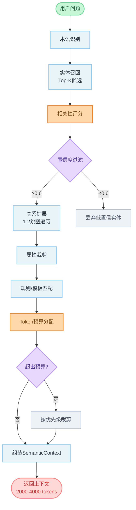

#### 4.3.2 多级检索策略

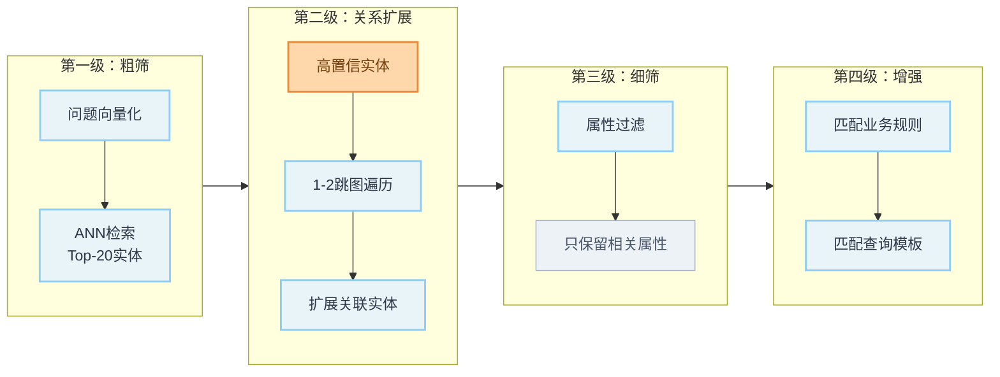

**示例流程**：

```
输入: "上个月销售额最高的客户是谁"

第一级 - 实体召回:
  ┌─────────────────────────────────────────┐
  │ 候选实体        │ 相似度  │ 触发词     │
  ├─────────────────┼─────────┼────────────┤
  │ customer        │ 0.92    │ "客户"     │
  │ order           │ 0.85    │ "销售额"   │
  │ sales_target    │ 0.72    │ "销售"     │
  │ product         │ 0.68    │ -          │
  └─────────────────────────────────────────┘

第二级 - 关系扩展:
  customer (0.92)
    → [places] → order (补充关联)
    → [belongs_to] → customer_group (低优先级)

  order (0.85)
    → [contains] → order_item
    → [references] → product

  扩展结果: [customer, order, order_item]

第三级 - 属性过滤:
  customer: customer_id, customer_name
            (去掉 address, phone, email 等非相关属性)
  order: order_id, order_amount, order_date, customer_id, status
            (去掉 shipping_address, notes 等)

第四级 - 规则/模板增强:
  业务规则: status != 'cancelled' (订单统计规则)
  查询模板: "Top N by metric" (置信度: 0.85)
```

#### 4.3.3 Token 预算管理

```python
@dataclass
class TokenBudget:
    """Token 预算配置"""

    total_budget: int = 3000  # 语义上下文总预算

    # 各部分预算分配
    allocation: Dict[str, int] = field(default_factory=lambda: {
        "term_mappings": 800,      # 术语映射 ~27%
        "entity_relations": 600,   # 实体关系 ~20%
        "business_rules": 500,     # 业务规则 ~17%
        "query_templates": 400,    # 查询模板 ~13%
        "join_conditions": 400,    # JOIN条件 ~13%
        "query_hints": 300,        # 查询建议 ~10%
    })

    # 优先级（超预算时从低优先级开始裁剪）
    priority: Dict[str, int] = field(default_factory=lambda: {
        "primary_entities": 1,     # 必须保留
        "join_keys": 1,            # 必须保留
        "related_entities": 2,     # 高优先级
        "business_rules": 3,       # 中优先级
        "query_templates": 4,      # 低优先级
        "synonyms": 5,             # 可选
        "descriptions": 5,         # 可选
    })


class TokenBudgetManager:
    """Token 预算管理器"""

    def allocate_and_trim(
        self,
        entities: List[SemanticEntity],
        relations: List[SemanticRelation],
        rules: List[BusinessRule],
        templates: List[QueryTemplate],
        budget: TokenBudget
    ) -> SemanticContext:
        """分配预算并裁剪内容"""

        context_parts = {}
        remaining_budget = budget.total_budget

        # 按优先级依次分配
        for priority in sorted(set(budget.priority.values())):
            items = self._get_items_by_priority(priority, entities, relations, rules, templates)

            for item in items:
                item_tokens = self._estimate_tokens(item)
                if item_tokens <= remaining_budget:
                    context_parts[item.id] = item
                    remaining_budget -= item_tokens
                else:
                    # 尝试裁剪低优先级字段
                    trimmed = self._trim_item(item, remaining_budget)
                    if trimmed:
                        context_parts[item.id] = trimmed
                        remaining_budget -= self._estimate_tokens(trimmed)

        return self._build_context(context_parts)

    def _estimate_tokens(self, content: Any) -> int:
        """估算 Token 数量"""
        text = str(content)
        # 中文约1.5字符/token，英文约4字符/token
        cn_chars = sum(1 for c in text if '\u4e00' <= c <= '\u9fff')
        en_chars = len(text) - cn_chars
        return int(cn_chars / 1.5 + en_chars / 4)
```

**预算分配可视化**：

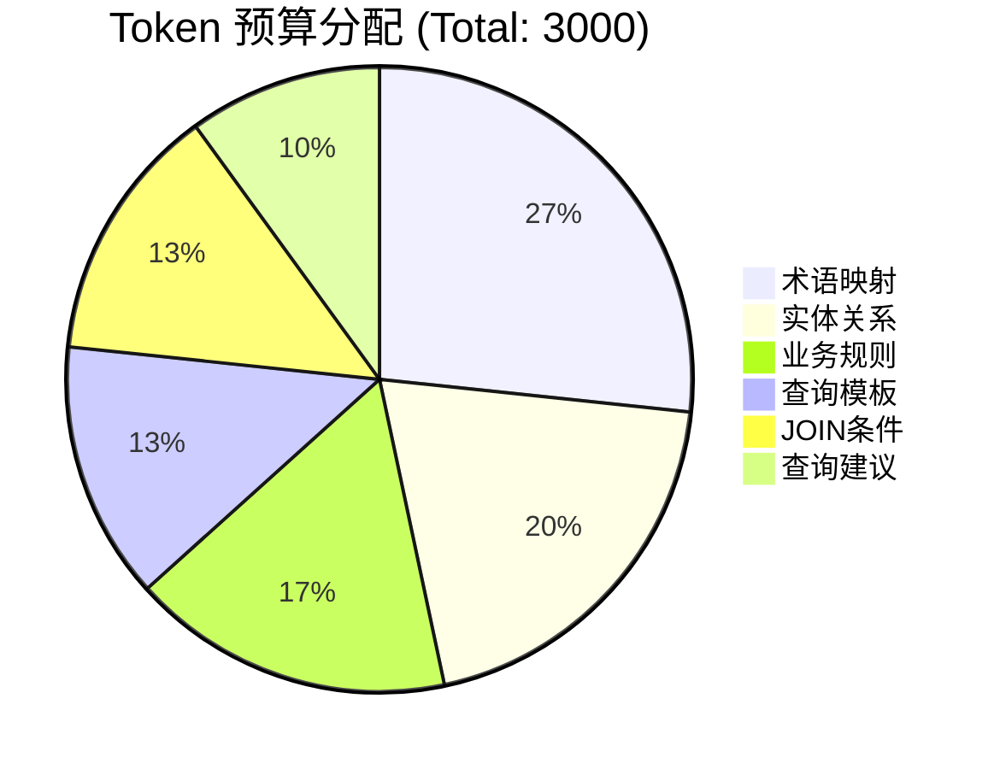

#### 4.3.4 相关性评分算法

```python
class RelevanceScorer:
    """相关性评分器"""

    def __init__(self, embedding_client: EmbeddingClient):
        self.embedding_client = embedding_client

        # 评分权重配置
        self.weights = {
            "semantic_similarity": 0.50,   # 语义相似度权重最高
            "term_match": 0.25,            # 术语匹配
            "usage_frequency": 0.15,       # 历史使用频率
            "relation_bonus": 0.10,        # 关系加成
        }

    async def score_entities(
        self,
        question: str,
        candidate_entities: List[SemanticEntity],
        context_entities: List[str] = None
    ) -> List[ScoredEntity]:
        """对候选实体进行评分"""

        # 1. 计算问题嵌入向量
        question_embedding = await self.embedding_client.embed(question)

        # 2. 提取问题中的术语
        question_terms = self._extract_terms(question)

        scored_results = []
        for entity in candidate_entities:
            # 语义相似度
            semantic_sim = cosine_similarity(
                question_embedding,
                entity.embedding
            )

            # 术语匹配（Jaccard相似度）
            entity_terms = set(entity.synonyms + [entity.name, entity.name_en])
            term_match = len(question_terms & entity_terms) / len(question_terms | entity_terms)

            # 使用频率（归一化）
            usage_freq = entity.query_count / self.max_query_count

            # 关系加成（如果与已选实体有关联）
            relation_bonus = 0.0
            if context_entities:
                related_count = len(set(entity.related_entities) & set(context_entities))
                relation_bonus = min(related_count * 0.1, 0.3)

            # 加权融合
            final_score = (
                self.weights["semantic_similarity"] * semantic_sim +
                self.weights["term_match"] * term_match +
                self.weights["usage_frequency"] * usage_freq +
                self.weights["relation_bonus"] * relation_bonus
            )

            scored_results.append(ScoredEntity(
                entity=entity,
                score=final_score,
                breakdown={
                    "semantic": semantic_sim,
                    "term": term_match,
                    "frequency": usage_freq,
                    "relation": relation_bonus
                }
            ))

        # 按分数排序
        return sorted(scored_results, key=lambda x: x.score, reverse=True)
```

#### 4.3.5 动态预算调整

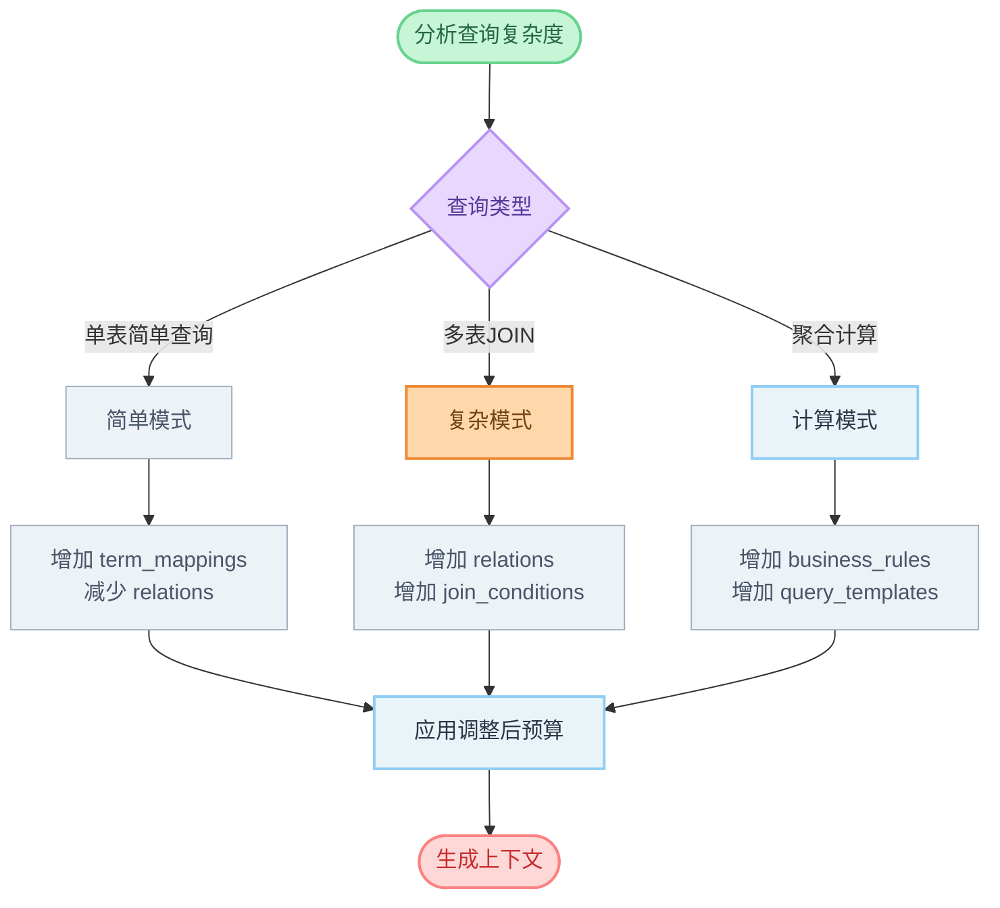

```python
class DynamicBudgetAdjuster:
    """动态预算调整器"""

    def adjust_budget(
        self,
        question: str,
        base_budget: TokenBudget,
        detected_entities: List[SemanticEntity]
    ) -> TokenBudget:
        """根据查询特征动态调整预算"""

        # 分析查询复杂度
        complexity = self._analyze_complexity(question, detected_entities)

        adjusted = copy.deepcopy(base_budget)

        if complexity.is_single_table:
            # 简单查询：增加术语映射预算
            adjusted.allocation["term_mappings"] += 200
            adjusted.allocation["entity_relations"] -= 200

        elif complexity.join_count >= 2:
            # 多表JOIN：增加关系和JOIN条件预算
            adjusted.allocation["entity_relations"] += 200
            adjusted.allocation["join_conditions"] += 200
            adjusted.allocation["query_hints"] -= 200
            adjusted.allocation["term_mappings"] -= 200

        if complexity.has_aggregation:
            # 聚合查询：增加规则和模板预算
            adjusted.allocation["business_rules"] += 150
            adjusted.allocation["query_templates"] += 150
            adjusted.allocation["query_hints"] -= 150
            adjusted.allocation["synonyms"] -= 150

        return adjusted
```

### 4.4 多级缓存架构

> 为了提升按需加载的性能，设计三级缓存架构，减少重复计算。

#### 4.4.1 缓存层级设计

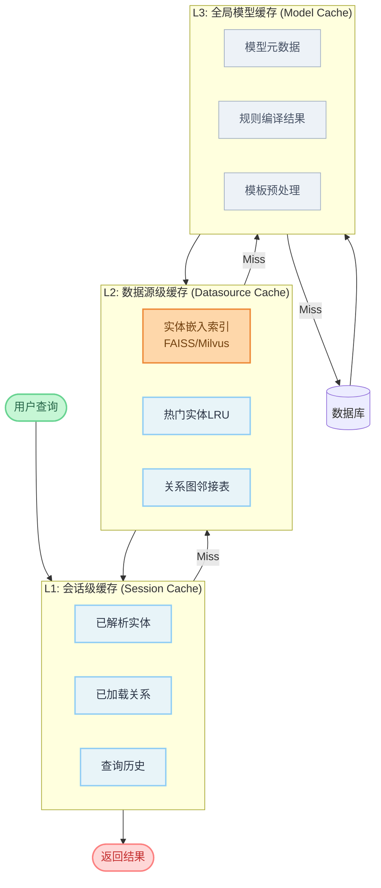

#### 4.4.2 缓存数据结构

```python
@dataclass
class SessionCache:
    """L1: 会话级缓存"""

    session_id: str
    datasource: str

    # 已加载的实体（避免重复加载）
    loaded_entities: Dict[str, SemanticEntity] = field(default_factory=dict)

    # 已解析的关系
    loaded_relations: Dict[str, SemanticRelation] = field(default_factory=dict)

    # 查询历史（用于上下文延续）
    query_history: List[QueryRecord] = field(default_factory=list)

    # 缓存统计
    hit_count: int = 0
    miss_count: int = 0

    # TTL: 会话结束或30分钟过期
    created_at: datetime = field(default_factory=datetime.now)
    ttl_minutes: int = 30

    def get_entity(self, entity_id: str) -> Optional[SemanticEntity]:
        """获取已缓存的实体"""
        if entity_id in self.loaded_entities:
            self.hit_count += 1
            return self.loaded_entities[entity_id]
        self.miss_count += 1
        return None

    def cache_entity(self, entity: SemanticEntity):
        """缓存实体"""
        self.loaded_entities[entity.entity_id] = entity


@dataclass
class DatasourceCache:
    """L2: 数据源级缓存"""

    datasource_name: str

    # 实体嵌入向量索引（支持ANN检索）
    entity_index: Any  # FAISSIndex or MilvusCollection

    # 热门实体缓存（LRU策略）
    hot_entities: LRUCache  # maxsize=100

    # 关系图（邻接表，支持快速图遍历）
    relation_graph: Dict[str, List[RelationEdge]]

    # 访问统计（用于热度计算）
    access_stats: Dict[str, AccessStat]

    # TTL: 1小时自动刷新
    last_refresh: datetime
    refresh_interval_minutes: int = 60

    async def search_entities(
        self,
        query_embedding: List[float],
        top_k: int = 20
    ) -> List[EntityMatch]:
        """向量检索实体"""
        return self.entity_index.search(query_embedding, top_k)

    def get_relations(self, entity_id: str, max_hops: int = 2) -> List[RelationEdge]:
        """BFS获取关联关系"""
        visited = set()
        result = []
        queue = [(entity_id, 0)]

        while queue:
            current, depth = queue.pop(0)
            if current in visited or depth > max_hops:
                continue
            visited.add(current)

            for edge in self.relation_graph.get(current, []):
                result.append(edge)
                queue.append((edge.target_entity, depth + 1))

        return result


class GlobalModelCache:
    """L3: 全局模型缓存 (Redis)"""

    def __init__(self, redis_client):
        self.redis = redis_client
        self.prefix = "semantic_model:"

    async def get_model_metadata(self, model_id: str) -> Optional[Dict]:
        """获取模型元数据"""
        key = f"{self.prefix}metadata:{model_id}"
        data = await self.redis.get(key)
        return json.loads(data) if data else None

    async def get_compiled_rules(self, model_id: str) -> List[CompiledRule]:
        """获取预编译的规则"""
        key = f"{self.prefix}rules:{model_id}"
        data = await self.redis.get(key)
        if data:
            return [CompiledRule.from_dict(r) for r in json.loads(data)]
        return []

    async def cache_model(self, model: SemanticModel, ttl: int = 3600):
        """缓存模型（默认1小时过期）"""
        # 缓存元数据
        await self.redis.setex(
            f"{self.prefix}metadata:{model.model_id}",
            ttl,
            json.dumps(model.to_metadata_dict())
        )

        # 预编译并缓存规则
        compiled_rules = [self._compile_rule(r) for r in model.business_rules]
        await self.redis.setex(
            f"{self.prefix}rules:{model.model_id}",
            ttl,
            json.dumps([r.to_dict() for r in compiled_rules])
        )
```

#### 4.4.3 缓存预热策略

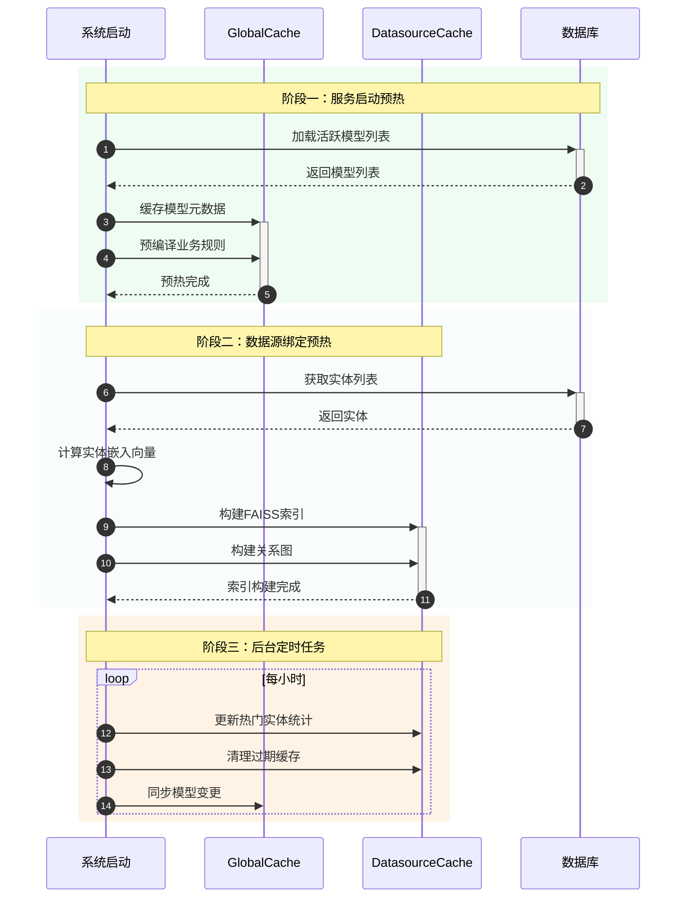

#### 4.4.4 缓存性能指标

| 缓存层级 | 命中率目标 | 响应时间目标 | 存储介质 |
|---------|-----------|-------------|---------|
| L1 会话缓存 | >80% | <5ms | 内存 (Dict) |
| L2 数据源缓存 | >60% | <20ms | 内存 (FAISS/LRU) |
| L3 全局缓存 | >90% | <50ms | Redis |
| 数据库 | - | <200ms | MySQL/Neo4j |

### 4.5 SemanticContextLoader 核心实现

将上述策略整合为统一的加载器：

```python
class SemanticContextLoader:
    """语义上下文按需加载器 - 核心组件"""

    def __init__(
        self,
        model_store: SemanticModelStore,
        embedding_client: EmbeddingClient,
        rule_engine: BusinessRuleEngine,
        template_engine: QueryTemplateEngine,
        cache_manager: CacheManager
    ):
        self.model_store = model_store
        self.embedding_client = embedding_client
        self.rule_engine = rule_engine
        self.template_engine = template_engine
        self.cache_manager = cache_manager

        self.scorer = RelevanceScorer(embedding_client)
        self.budget_manager = TokenBudgetManager()
        self.budget_adjuster = DynamicBudgetAdjuster()

    async def load_context(
        self,
        question: str,
        datasource: str,
        session_id: Optional[str] = None,
        token_budget: int = 3000
    ) -> SemanticContext:
        """
        按需加载语义上下文

        Args:
            question: 用户问题
            datasource: 数据源名称
            session_id: 会话ID（用于复用缓存）
            token_budget: Token预算

        Returns:
            SemanticContext: 裁剪后的语义上下文
        """

        # Step 1: 获取或创建会话缓存
        session_cache = self.cache_manager.get_session_cache(session_id)
        cached_entities = session_cache.loaded_entities if session_cache else {}

        # Step 2: 术语识别 + 实体召回（使用L2缓存的FAISS索引）
        question_embedding = await self.embedding_client.embed(question)
        datasource_cache = self.cache_manager.get_datasource_cache(datasource)

        candidate_entities = await datasource_cache.search_entities(
            question_embedding,
            top_k=20,
            exclude=list(cached_entities.keys())  # 排除已缓存
        )

        # Step 3: 相关性评分 + 阈值过滤
        scored_entities = await self.scorer.score_entities(
            question,
            candidate_entities,
            context_entities=list(cached_entities.keys())
        )

        filtered_entities = [
            se for se in scored_entities
            if se.score >= 0.6  # 置信度阈值
        ]

        # Step 4: 关系扩展（1-2跳图遍历）
        expanded_entities = self._expand_by_relations(
            filtered_entities,
            datasource_cache.relation_graph,
            max_hops=2,
            max_expand=10
        )

        # Step 5: 合并缓存实体
        all_entities = {**cached_entities, **{e.entity_id: e for e in expanded_entities}}

        # Step 6: 动态调整预算
        base_budget = TokenBudget(total_budget=token_budget)
        adjusted_budget = self.budget_adjuster.adjust_budget(
            question, base_budget, list(all_entities.values())
        )

        # Step 7: 匹配规则和模板
        applicable_rules = await self.rule_engine.match_rules(
            list(all_entities.keys())
        )
        matched_templates = await self.template_engine.match_templates(
            question, list(all_entities.values())
        )

        # Step 8: Token预算分配 + 内容裁剪
        context = self.budget_manager.allocate_and_trim(
            entities=list(all_entities.values()),
            relations=self._get_relations(all_entities.keys(), datasource_cache),
            rules=applicable_rules,
            templates=matched_templates,
            budget=adjusted_budget
        )

        # Step 9: 更新会话缓存
        if session_cache:
            for entity in expanded_entities:
                session_cache.cache_entity(entity)

        return context

    def _expand_by_relations(
        self,
        entities: List[ScoredEntity],
        relation_graph: Dict,
        max_hops: int,
        max_expand: int
    ) -> List[SemanticEntity]:
        """通过关系图扩展实体"""
        result = [se.entity for se in entities]
        expanded_ids = set(e.entity_id for e in result)

        for se in entities[:5]:  # 只从Top-5实体扩展
            related = relation_graph.get(se.entity.entity_id, [])
            for edge in related[:max_expand]:
                if edge.target_entity not in expanded_ids:
                    target = self.model_store.get_entity(edge.target_entity)
                    if target:
                        result.append(target)
                        expanded_ids.add(target.entity_id)

        return result
```

---

## 5. 集成点设计

### 5.1 Agent 资源层集成 - SemanticResource

```python
# packages/dbgpt-core/src/dbgpt/agent/resource/semantic.py

class SemanticDBResource(Resource[SemanticDBResourceParameters]):
    """语义增强的数据库资源"""

    def __init__(
        self,
        name: str,
        db_resource: RDBMSConnectorResource,
        semantic_manager: SemanticModelManager
    ):
        super().__init__(name)
        self._db_resource = db_resource
        self._semantic_manager = semantic_manager

    @property
    def resource_type(self) -> ResourceType:
        return ResourceType.DB

    async def get_prompt(
        self,
        question: Optional[str] = None,
        resource_args: Optional[Dict] = None,
        **kwargs
    ) -> Tuple[str, Optional[Dict]]:
        """
        获取语义增强的提示词
        """
        # 1. 获取基础schema提示词
        base_prompt, refs = await self._db_resource.get_prompt(
            question, resource_args, **kwargs
        )

        # 2. 获取语义上下文
        semantic_ctx = await self._semantic_manager.get_semantic_context(
            datasource_name=self._db_resource.db_name,
            question=question
        )

        # 3. 构建增强提示词
        enhanced_prompt = self._build_enhanced_prompt(
            base_prompt, semantic_ctx
        )

        # 4. 添加语义引用
        semantic_refs = self._build_semantic_refs(semantic_ctx)
        if refs:
            refs.update(semantic_refs)
        else:
            refs = semantic_refs

        return enhanced_prompt, refs

    def _build_enhanced_prompt(
        self,
        base_prompt: str,
        ctx: SemanticContext
    ) -> str:
        """构建增强提示词"""
        return f"""{base_prompt}

## 语义上下文 (Semantic Context)

{ctx.to_prompt_string()}

## 使用指南
1. 优先使用上述业务术语映射来理解用户问题
2. 根据实体关系构建正确的JOIN语句
3. 遵循业务规则中的约束条件
4. 参考查询建议中的SQL模式
"""

    async def async_execute(
        self,
        sql: str,
        **kwargs
    ) -> Tuple[List[str], List[Tuple]]:
        """
        执行SQL（可选：执行前验证业务规则）
        """
        # 可选：验证SQL是否符合业务规则
        # validation = await self._semantic_manager.validate_sql(sql, ...)

        return await self._db_resource.async_execute(sql, **kwargs)
```

### 5.2 RAG 层集成 - SemanticDBSummaryClient

```python
# packages/dbgpt-serve/src/dbgpt_serve/datasource/service/semantic_summary_client.py

class SemanticDBSummaryClient(DBSummaryClient):
    """语义增强的数据库摘要客户端"""

    def __init__(self, system_app: SystemApp):
        super().__init__(system_app)
        self._semantic_manager: SemanticModelManager = None

    def init_app(self, system_app: SystemApp):
        super().init_app(system_app)
        self._semantic_manager = SemanticModelManager.get_instance(system_app)

    async def get_db_summary(
        self,
        dbname: str,
        query: str,
        topk: int = 10
    ) -> str:
        """
        获取语义增强的数据库摘要
        """
        # 1. 获取物理schema摘要
        physical_summary = await super().get_db_summary(dbname, query, topk)

        # 2. 检查是否有绑定的语义模型
        has_semantic = await self._semantic_manager.has_bound_model(dbname)
        if not has_semantic:
            return physical_summary

        # 3. 获取语义上下文
        semantic_ctx = await self._semantic_manager.get_semantic_context(
            datasource_name=dbname,
            question=query,
            include_rules=True,
            include_templates=True,
            include_reasoning=False  # 摘要阶段不需要推理规则
        )

        # 4. 合并为增强摘要
        return self._merge_summaries(physical_summary, semantic_ctx)

    def _merge_summaries(
        self,
        physical: str,
        ctx: SemanticContext
    ) -> str:
        """合并物理和语义摘要"""
        return f"""{physical}

---
## 语义模型信息

{ctx.to_prompt_string()}
"""
```

### 5.3 Scene 层集成 - SemanticAwareBaseChat

```python
# packages/dbgpt-app/src/dbgpt_app/scene/semantic_base.py

class SemanticAwareBaseChat(BaseChat):
    """语义感知的基础Chat类"""

    def __init__(self, chat_param: ChatParam, system_app: SystemApp):
        super().__init__(chat_param, system_app)
        self._semantic_manager = SemanticModelManager.get_instance(system_app)
        self._semantic_context: Optional[SemanticContext] = None

    @trace()
    async def generate_input_values(self) -> Dict:
        """生成包含语义上下文的输入值"""
        # 调用父类获取基础输入
        input_values = await super().generate_input_values()

        # 检查是否有绑定的语义模型
        db_name = input_values.get("db_name")
        if db_name and await self._semantic_manager.has_bound_model(db_name):
            # 获取语义上下文
            self._semantic_context = await self._semantic_manager.get_semantic_context(
                datasource_name=db_name,
                question=self.current_user_input.last_text
            )

            # 注入语义变量
            input_values["semantic_context"] = self._semantic_context.to_prompt_string()
            input_values["business_terms"] = self._format_term_mappings()
            input_values["entity_relationships"] = self._format_relationships()
            input_values["business_rules"] = self._format_rules()
            input_values["query_hints"] = self._format_hints()

        return input_values

    def _format_term_mappings(self) -> str:
        """格式化术语映射"""
        if not self._semantic_context:
            return ""
        lines = []
        for tm in self._semantic_context.term_mappings:
            lines.append(f"- {tm.business_term}: {tm.physical_path}")
        return "\n".join(lines)

    # ... 其他格式化方法
```

---

## 6. 存储方案设计

### 6.1 推荐方案：混合存储

```
┌─────────────────────────────────────────────────────────────────┐
│                        混合存储架构                              │
├─────────────────────────────────────────────────────────────────┤
│                                                                  │
│  ┌─────────────────┐  ┌─────────────────┐  ┌─────────────────┐  │
│  │    MySQL/SQLite │  │     Neo4j       │  │  Vector Store   │  │
│  │   (元数据存储)   │  │  (关系图存储)    │  │  (语义嵌入)      │  │
│  ├─────────────────┤  ├─────────────────┤  ├─────────────────┤  │
│  │ • 模型基本信息   │  │ • 实体节点      │  │ • 实体嵌入向量  │  │
│  │ • 实体定义      │  │ • 关系边        │  │ • 属性嵌入向量  │  │
│  │ • 属性定义      │  │ • 路径查询      │  │ • 相似度检索    │  │
│  │ • 规则定义      │  │ • 图遍历        │  │ • 术语匹配      │  │
│  │ • 模板定义      │  │                 │  │                 │  │
│  └─────────────────┘  └─────────────────┘  └─────────────────┘  │
│           │                    │                    │           │
│           └────────────────────┼────────────────────┘           │
│                                │                                 │
│                    ┌───────────▼───────────┐                    │
│                    │  SemanticModelStore   │                    │
│                    │    (统一存储接口)      │                    │
│                    └───────────────────────┘                    │
│                                                                  │
└─────────────────────────────────────────────────────────────────┘
```

### 6.2 RDBMS 表结构设计

```sql
-- 语义模型表
CREATE TABLE semantic_model (
    model_id VARCHAR(64) PRIMARY KEY,
    name VARCHAR(255) NOT NULL,
    version VARCHAR(32) NOT NULL,
    description TEXT,
    status VARCHAR(32) DEFAULT 'draft',
    created_at DATETIME DEFAULT CURRENT_TIMESTAMP,
    updated_at DATETIME DEFAULT CURRENT_TIMESTAMP ON UPDATE CURRENT_TIMESTAMP,
    created_by VARCHAR(64),
    extra_config JSON
);

-- 语义域表
CREATE TABLE semantic_domain (
    domain_id VARCHAR(64) PRIMARY KEY,
    model_id VARCHAR(64) NOT NULL,
    name VARCHAR(255) NOT NULL,
    name_en VARCHAR(255),
    description TEXT,
    parent_domain_id VARCHAR(64),
    icon VARCHAR(255),
    sort_order INT DEFAULT 0,
    FOREIGN KEY (model_id) REFERENCES semantic_model(model_id),
    FOREIGN KEY (parent_domain_id) REFERENCES semantic_domain(domain_id)
);

-- 语义实体表
CREATE TABLE semantic_entity (
    entity_id VARCHAR(64) PRIMARY KEY,
    model_id VARCHAR(64) NOT NULL,
    domain_id VARCHAR(64),
    name VARCHAR(255) NOT NULL,
    name_en VARCHAR(255),
    description TEXT,
    entity_type VARCHAR(32) DEFAULT 'master',
    synonyms JSON,
    tags JSON,
    created_at DATETIME DEFAULT CURRENT_TIMESTAMP,
    updated_at DATETIME DEFAULT CURRENT_TIMESTAMP ON UPDATE CURRENT_TIMESTAMP,
    FOREIGN KEY (model_id) REFERENCES semantic_model(model_id),
    FOREIGN KEY (domain_id) REFERENCES semantic_domain(domain_id)
);

-- 物理映射表
CREATE TABLE physical_mapping (
    mapping_id VARCHAR(64) PRIMARY KEY,
    entity_id VARCHAR(64) NOT NULL,
    datasource_name VARCHAR(255) NOT NULL,
    database_name VARCHAR(255),
    schema_name VARCHAR(255),
    table_name VARCHAR(255) NOT NULL,
    mapping_type VARCHAR(32) DEFAULT 'primary',
    filter_condition TEXT,
    FOREIGN KEY (entity_id) REFERENCES semantic_entity(entity_id)
);

-- 语义属性表
CREATE TABLE semantic_property (
    property_id VARCHAR(64) PRIMARY KEY,
    entity_id VARCHAR(64) NOT NULL,
    name VARCHAR(255) NOT NULL,
    name_en VARCHAR(255),
    description TEXT,
    physical_column VARCHAR(255) NOT NULL,
    semantic_type VARCHAR(64),
    physical_type VARCHAR(128),
    is_measure BOOLEAN DEFAULT FALSE,
    is_dimension BOOLEAN DEFAULT TRUE,
    default_aggregation VARCHAR(32),
    display_format VARCHAR(128),
    unit VARCHAR(64),
    value_range JSON,
    nullable BOOLEAN DEFAULT TRUE,
    default_value VARCHAR(255),
    synonyms JSON,
    sort_order INT DEFAULT 0,
    FOREIGN KEY (entity_id) REFERENCES semantic_entity(entity_id)
);

-- 语义关系表
CREATE TABLE semantic_relation (
    relation_id VARCHAR(64) PRIMARY KEY,
    model_id VARCHAR(64) NOT NULL,
    name VARCHAR(255) NOT NULL,
    name_en VARCHAR(255),
    description TEXT,
    source_entity_id VARCHAR(64) NOT NULL,
    target_entity_id VARCHAR(64) NOT NULL,
    relation_type VARCHAR(32) NOT NULL,
    join_type VARCHAR(32) DEFAULT 'inner',
    join_condition TEXT NOT NULL,
    through_table VARCHAR(255),
    through_source_column VARCHAR(255),
    through_target_column VARCHAR(255),
    forward_description TEXT,
    reverse_description TEXT,
    is_required BOOLEAN DEFAULT FALSE,
    FOREIGN KEY (model_id) REFERENCES semantic_model(model_id),
    FOREIGN KEY (source_entity_id) REFERENCES semantic_entity(entity_id),
    FOREIGN KEY (target_entity_id) REFERENCES semantic_entity(entity_id)
);

-- 业务规则表
CREATE TABLE business_rule (
    rule_id VARCHAR(64) PRIMARY KEY,
    model_id VARCHAR(64) NOT NULL,
    name VARCHAR(255) NOT NULL,
    description TEXT,
    rule_type VARCHAR(32) NOT NULL,
    expression TEXT NOT NULL,
    expression_type VARCHAR(32) DEFAULT 'sql',
    applies_to_entities JSON,
    applies_to_properties JSON,
    priority INT DEFAULT 0,
    error_message TEXT,
    error_level VARCHAR(32) DEFAULT 'error',
    is_active BOOLEAN DEFAULT TRUE,
    FOREIGN KEY (model_id) REFERENCES semantic_model(model_id)
);

-- 查询模板表
CREATE TABLE query_template (
    template_id VARCHAR(64) PRIMARY KEY,
    model_id VARCHAR(64) NOT NULL,
    name VARCHAR(255) NOT NULL,
    description TEXT,
    intent_patterns JSON,
    intent_keywords JSON,
    sql_template TEXT NOT NULL,
    parameters JSON,
    applicable_entities JSON,
    applicable_domains JSON,
    template_type VARCHAR(32) DEFAULT 'query',
    priority INT DEFAULT 0,
    is_active BOOLEAN DEFAULT TRUE,
    FOREIGN KEY (model_id) REFERENCES semantic_model(model_id)
);

-- 推理规则表
CREATE TABLE reasoning_rule (
    rule_id VARCHAR(64) PRIMARY KEY,
    model_id VARCHAR(64) NOT NULL,
    name VARCHAR(255) NOT NULL,
    description TEXT,
    trigger_condition TEXT,
    trigger_type VARCHAR(32),
    reasoning_template TEXT NOT NULL,
    output_format VARCHAR(32) DEFAULT 'text',
    applies_to_entities JSON,
    applies_to_metrics JSON,
    priority INT DEFAULT 0,
    is_active BOOLEAN DEFAULT TRUE,
    FOREIGN KEY (model_id) REFERENCES semantic_model(model_id)
);

-- 模型数据源绑定表
CREATE TABLE model_datasource_binding (
    binding_id VARCHAR(64) PRIMARY KEY,
    model_id VARCHAR(64) NOT NULL,
    datasource_name VARCHAR(255) NOT NULL,
    binding_status VARCHAR(32) DEFAULT 'active',
    last_validated_at DATETIME,
    validation_result JSON,
    created_at DATETIME DEFAULT CURRENT_TIMESTAMP,
    FOREIGN KEY (model_id) REFERENCES semantic_model(model_id),
    UNIQUE KEY uk_model_datasource (model_id, datasource_name)
);

-- 索引
CREATE INDEX idx_entity_domain ON semantic_entity(domain_id);
CREATE INDEX idx_property_entity ON semantic_property(entity_id);
CREATE INDEX idx_mapping_datasource ON physical_mapping(datasource_name);
CREATE INDEX idx_relation_source ON semantic_relation(source_entity_id);
CREATE INDEX idx_relation_target ON semantic_relation(target_entity_id);
```

---

## 7. API 设计

### 7.1 REST API 端点

```python
# packages/dbgpt-serve/src/dbgpt_serve/semantic/api/endpoints.py

router = APIRouter(prefix="/api/v1/semantic", tags=["Semantic Model"])

# ==================== 模型管理 ====================

@router.post("/models/import")
async def import_model(
    request: SemanticModelImportRequest
) -> SemanticModelResponse:
    """
    导入语义模型

    支持格式: owl, json-ld, json, excel
    """
    pass

@router.get("/models")
async def list_models(
    page: int = 1,
    page_size: int = 20,
    status: Optional[str] = None
) -> PaginatedResponse[SemanticModelSummary]:
    """获取语义模型列表"""
    pass

@router.get("/models/{model_id}")
async def get_model(model_id: str) -> SemanticModelResponse:
    """获取语义模型详情"""
    pass

@router.put("/models/{model_id}")
async def update_model(
    model_id: str,
    request: SemanticModelUpdateRequest
) -> SemanticModelResponse:
    """更新语义模型"""
    pass

@router.delete("/models/{model_id}")
async def delete_model(model_id: str) -> SuccessResponse:
    """删除语义模型"""
    pass

@router.post("/models/{model_id}/publish")
async def publish_model(model_id: str) -> SemanticModelResponse:
    """发布语义模型"""
    pass

# ==================== 数据源绑定 ====================

@router.post("/models/{model_id}/bind")
async def bind_datasource(
    model_id: str,
    request: DatasourceBindRequest
) -> BindingResultResponse:
    """
    绑定数据源

    执行:
    1. 验证物理映射
    2. 生成语义嵌入
    3. 创建绑定关系
    """
    pass

@router.delete("/models/{model_id}/bind/{datasource_name}")
async def unbind_datasource(
    model_id: str,
    datasource_name: str
) -> SuccessResponse:
    """解绑数据源"""
    pass

@router.post("/models/{model_id}/validate")
async def validate_model(
    model_id: str,
    datasource_name: Optional[str] = None
) -> ValidationResultResponse:
    """验证语义模型"""
    pass

# ==================== 实体管理 ====================

@router.get("/models/{model_id}/entities")
async def list_entities(
    model_id: str,
    domain_id: Optional[str] = None
) -> List[SemanticEntityResponse]:
    """获取实体列表"""
    pass

@router.post("/models/{model_id}/entities")
async def create_entity(
    model_id: str,
    request: SemanticEntityCreateRequest
) -> SemanticEntityResponse:
    """创建实体"""
    pass

@router.put("/models/{model_id}/entities/{entity_id}")
async def update_entity(
    model_id: str,
    entity_id: str,
    request: SemanticEntityUpdateRequest
) -> SemanticEntityResponse:
    """更新实体"""
    pass

# ==================== 关系管理 ====================

@router.get("/models/{model_id}/relations")
async def list_relations(model_id: str) -> List[SemanticRelationResponse]:
    """获取关系列表"""
    pass

@router.post("/models/{model_id}/relations")
async def create_relation(
    model_id: str,
    request: SemanticRelationCreateRequest
) -> SemanticRelationResponse:
    """创建关系"""
    pass

# ==================== 规则管理 ====================

@router.get("/models/{model_id}/rules")
async def list_rules(
    model_id: str,
    rule_type: Optional[str] = None
) -> List[BusinessRuleResponse]:
    """获取业务规则列表"""
    pass

@router.post("/models/{model_id}/rules")
async def create_rule(
    model_id: str,
    request: BusinessRuleCreateRequest
) -> BusinessRuleResponse:
    """创建业务规则"""
    pass

# ==================== 模板管理 ====================

@router.get("/models/{model_id}/templates")
async def list_templates(model_id: str) -> List[QueryTemplateResponse]:
    """获取查询模板列表"""
    pass

@router.post("/models/{model_id}/templates")
async def create_template(
    model_id: str,
    request: QueryTemplateCreateRequest
) -> QueryTemplateResponse:
    """创建查询模板"""
    pass

# ==================== 查询增强 ====================

@router.post("/context")
async def get_semantic_context(
    request: SemanticContextRequest
) -> SemanticContextResponse:
    """
    获取语义上下文

    用于调试和测试语义增强效果
    """
    pass

@router.post("/resolve-terms")
async def resolve_terms(
    request: TermResolveRequest
) -> List[TermResolutionResponse]:
    """解析业务术语"""
    pass

@router.post("/suggest-sql")
async def suggest_sql(
    request: SQLSuggestRequest
) -> SQLSuggestionResponse:
    """
    基于语义模型建议SQL

    结合查询模板和业务规则
    """
    pass
```

### 7.2 请求/响应模型

```python
# packages/dbgpt-serve/src/dbgpt_serve/semantic/api/schemas.py

class SemanticModelImportRequest(BaseModel):
    """导入请求"""
    name: str
    version: str = "1.0.0"
    description: Optional[str] = None
    format: str  # owl, json-ld, json, excel
    content: str  # Base64 encoded content or JSON string
    datasource_name: Optional[str] = None  # 可选：立即绑定数据源

class SemanticContextRequest(BaseModel):
    """语义上下文请求"""
    datasource_name: str
    question: str
    include_rules: bool = True
    include_templates: bool = True
    include_reasoning: bool = False

class SemanticContextResponse(BaseModel):
    """语义上下文响应"""
    term_mappings: List[TermMappingDTO]
    relationships: List[RelationshipDTO]
    applicable_rules: List[BusinessRuleDTO]
    query_hints: List[QueryHintDTO]
    reasoning_rules: List[ReasoningRuleDTO]
    prompt_text: str  # 完整的提示词文本

class DatasourceBindRequest(BaseModel):
    """数据源绑定请求"""
    datasource_name: str
    auto_map: bool = True  # 自动映射（根据名称相似度）
    mapping_overrides: Optional[Dict[str, str]] = None  # 手动覆盖映射
```

---

## 8. 实现计划

### 8.1 阶段划分

| 阶段 | 内容 | 交付物 | 优先级 |
|------|------|--------|--------|
| **Phase 1** | 核心基础设施 | 数据模型、存储层、基础Manager | P0 |
| **Phase 2** | Agent集成 | SemanticResource、DBSummaryClient增强 | P0 |
| **Phase 3** | 规则与模板 | BusinessRuleEngine、QueryTemplateEngine | P1 |
| **Phase 4** | 平台集成 | 导入API、同步机制、验证 | P1 |
| **Phase 5** | 高级功能 | 推理规则、联邦查询支持 | P2 |

### 8.2 Phase 1 详细任务

```
Phase 1: 核心基础设施 (预计 5-7 天)

├── 1.1 数据模型定义 (1天)
│   ├── 创建 packages/dbgpt-core/src/dbgpt/semantic/model/
│   ├── 定义所有数据类 (schema.py)
│   └── 定义数据传输对象 (dto.py)
│
├── 1.2 存储层实现 (2天)
│   ├── 创建 packages/dbgpt-core/src/dbgpt/semantic/store/
│   ├── 实现 SemanticModelStore 接口
│   ├── 实现 RDBMSSemanticStore (MySQL存储)
│   └── 创建数据库迁移脚本
│
├── 1.3 Manager 基础实现 (2天)
│   ├── 创建 packages/dbgpt-serve/src/dbgpt_serve/semantic/
│   ├── 实现 SemanticModelManager 核心方法
│   │   ├── 模型 CRUD
│   │   ├── 数据源绑定
│   │   └── get_semantic_context 基础版
│   └── 注册为系统组件
│
└── 1.4 基础 API (1天)
    ├── 创建 API 端点 (模型管理、绑定)
    ├── 创建请求/响应模型
    └── 集成到 API Router
```

### 8.3 文件结构

```
packages/
├── dbgpt-core/src/dbgpt/
│   └── semantic/                       # 核心语义模块
│       ├── __init__.py
│       ├── model/                      # 数据模型
│       │   ├── __init__.py
│       │   ├── schema.py               # 核心数据类定义
│       │   ├── dto.py                  # 数据传输对象
│       │   └── context.py              # SemanticContext
│       ├── store/                      # 存储层
│       │   ├── __init__.py
│       │   ├── base.py                 # 存储接口
│       │   ├── rdbms_store.py          # RDBMS实现
│       │   └── neo4j_store.py          # Neo4j实现(可选)
│       └── engine/                     # 引擎
│           ├── __init__.py
│           ├── rule_engine.py          # 业务规则引擎
│           └── template_engine.py      # 查询模板引擎
│
├── dbgpt-serve/src/dbgpt_serve/
│   └── semantic/                       # 语义服务模块
│       ├── __init__.py
│       ├── service/
│       │   ├── __init__.py
│       │   ├── manager.py              # SemanticModelManager
│       │   ├── import_service.py       # 导入服务
│       │   └── embedding_service.py    # 嵌入服务
│       ├── api/
│       │   ├── __init__.py
│       │   ├── endpoints.py            # REST API
│       │   └── schemas.py              # Pydantic模型
│       └── db/
│           ├── __init__.py
│           └── models.py               # ORM模型
│
└── dbgpt-app/src/dbgpt_app/
    └── scene/
        ├── semantic_base.py            # SemanticAwareBaseChat
        └── semantic_prompt_adapter.py  # 语义提示词适配器
```

---

## 9. 测试策略

### 9.1 单元测试

```python
# tests/unit/semantic/test_manager.py

class TestSemanticModelManager:

    async def test_import_model_json(self):
        """测试JSON格式模型导入"""
        pass

    async def test_bind_datasource(self):
        """测试数据源绑定"""
        pass

    async def test_get_semantic_context(self):
        """测试语义上下文获取"""
        pass

    async def test_term_resolution(self):
        """测试术语解析"""
        pass
```

### 9.2 集成测试

```python
# tests/integration/semantic/test_text2sql_enhancement.py

class TestText2SQLEnhancement:

    async def test_semantic_enhanced_sql_generation(self):
        """
        测试语义增强的SQL生成

        场景: 用户问"上个月销售额最高的客户是谁"
        期望: 正确理解"销售额"→order_amount, "客户"→customer
        """
        pass

    async def test_join_suggestion(self):
        """测试JOIN建议"""
        pass

    async def test_business_rule_validation(self):
        """测试业务规则验证"""
        pass
```

---

## 10. 风险与缓解

| 风险 | 影响 | 缓解措施 |
|------|------|----------|
| 语义模型维护成本高 | 模型过时导致效果下降 | 提供自动验证和同步机制 |
| 术语歧义 | 错误映射导致SQL错误 | 支持同义词、上下文消歧 |
| 性能开销 | 查询延迟增加 | 语义嵌入缓存、异步预加载 |
| 模型导入复杂 | 用户难以使用 | 提供可视化映射工具、模板 |

---

## 11. 参考资料

- DB-GPT Agent 架构: `packages/dbgpt-core/src/dbgpt/agent/`
- DB-GPT Connector 架构: `packages/dbgpt-serve/src/dbgpt_serve/datasource/`
- 现有 ontology_execute Scene: `packages/dbgpt-app/src/dbgpt_app/scene/chat_db/ontology_execute/`
